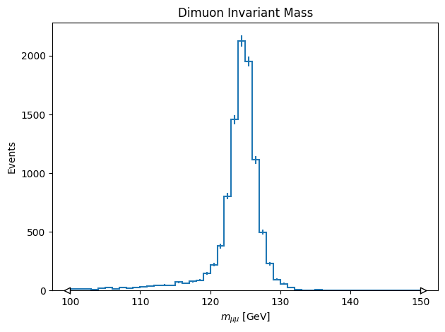

Using Uproot
=================

## Import Needed Functions

To create our query and send it to the backend, we need a few functions and classes. Let's import them.

```
from servicex import deliver, query, dataset

import awkward as ak
import uproot
import vector
vector.register_awkward()
import hist

import matplotlib.pyplot as plt
```

The dataset and query objects are used to define our request and are then packaged into a spec. The deliver function sends the spec to the backend.

## Setting Up Our Dataset

Before we build our query and spec, we need to specify our dataset. ServiceX supports multiple types of datasets, but all types must be publicly accessible or available to all CMS users. More information about supported dataset locations can be found in our full documentation.

For this tutorial, we’ll use a nanoaod that is stored in EOS.

```
file = "root://eos.cms.rcac.purdue.edu:1094//store/mc/RunIII2024Summer24NanoAODv15/VBFH-Hto2Mu_Par-M-125_TuneCP5_13p6TeV_powheg-pythia8/NANOAODSIM/150X_mcRun3_2024_realistic_v2-v2/100000/1d437865-3bfb-4d90-b596-c2f638d398f3.root"
nanoaod_dataset = dataset.FileList([file])
```

## Building Our Query

The second thing needed to construct our spec is the query. Here we define the data we would like selected and we can also define cuts. For uproot-raw queries the treename needs to be define, then the branches selected, and then finally cuts can be made.

```
uproot_raw_query = query.UprootRaw([{
        'treename':'Events',
        'filter_name':
            ["Muon_pt", "Muon_eta", "Muon_phi", "Muon_mass", 'Muon_mediumId', 'Muon_charge'],
        'cut': '(nMuon == 2) & all(Muon_mediumId & (Muon_pt > 20) & (abs(Muon_eta) < 2.4)) & (sum(Muon_charge) == 0)'
    }]
)
```

## Building The Spec

The hard work has been done and now we just need to package everything up in a spec object before we pass it to the deliver. Here is how that is done for this example:

```
spec_uproot_raw = {
    'Sample': [{
        'Name': 'UprootRawExample',
        'Dataset': nanoaod_dataset,
        'Query': uproot_raw_query
    }]
```

## Deliver The Spec

Now that we have a spec setup we can deliver it to the backend.

```
results_uproot_raw=deliver(spec_uproot_raw)
```

The deliver function sends the query to the backend where the transform is processed. Then the processed files are downloaded to the client (in a configured directory). The variable results_uproot_raw has a list of those files. This list is what can be used to start the analysis of those files.

## Analyze The Data

```
# Read output file
skimmed_file = results_uproot_raw["UprootRawExample"][0]
with uproot.open(skimmed_file) as f:
    arrays = f["Events"].arrays()

# Compute dimuon mass
muons = ak.zip({
    'pt':   arrays['Muon_pt'],
    'eta':  arrays['Muon_eta'],
    'phi':  arrays['Muon_phi'],
    'mass': arrays['Muon_mass'],
}, with_name='Momentum4D')

dimuon_mass = (muons[:, 0] + muons[:, 1]).mass

# Plot dimuon mass
h = hist.Hist(hist.axis.Regular(50, 100, 150, label=r'$m_{\mu\mu}$ [GeV]'))
h.fill(dimuon_mass)

h.plot()
plt.title('Dimuon Invariant Mass')
plt.ylabel('Events')

plt.tight_layout()
plt.show()
```

The result from this code is the following plots:

