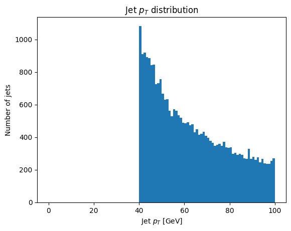

Using FuncADL
==================

## Additional Instal

In order to use FuncADL we must install an additional package.

```
pip install func_adl_servicex_xaodr25
```

## Import Needed Functions

To create our query and send it to the backend, we need some functions and classes. Let's import them.

```
from servicex import deliver, query, dataset
```

The dataset and query objects are imported to build the specification that will be sent to the backend. The deliver function sends the specification to the backend. We can also import one of our analysis utilities, to_awk, which processes the data returned from ServiceX.

```
from servicex_analysis_utils import to_awk
```

There is also an object that is required to build the query. A function can be used to start the query and this can be imported as so:

```
from func_adl_servicex_xaodr25 import FuncADLQueryPHYSLITE
```

## Setting Up Our Dataset

Before we build our query and spec, we need to specify our dataset. ServiceX supports multiple types of datasets, but all types must be publicly accessible or available to all ATLAS users. More information about supported dataset locations can be found in our full documentation.

The location of the dataset that you would like to use dictates what type of object we use to start the dataset. If your xAOD file is stored in eos you can declare your dataset like this:

```
eos_dataset = dataset.FileList(["root://eospublic.cern.ch//eos/opendata/atlas/rucio/mc20_13TeV/DAOD_PHYSLITE.38191209._000001.pool.root.1"])
```

If your dataset is stored in rucio you can declare your dataset like this:

```
rucio_dataset = dataset.Rucio('mc20_13TeV:DAOD_PHYSLITE.38191209._000001.pool.root.1')
```

## Building Our Query

The second thing needed to construct our spec is the query. Here we define the data we would like selected and we can also define cuts. To build out our we will use FuncADL. As mentioned earlier FuncADL is a more complicated, but more powerful tool for xAOD than using the Uproot backend. To understand better how the query below is constructed see the FuncADL docs linked in the Navigation Bar above.

For a simple example of getting some Jets from the dataset and making a 30 GeV cut we will use the query below.

```
query = FuncADLQueryPHYSLITE()
jets_per_event = (query
    .Select(lambda e: e.Jets().Where(lambda j: (j.pt() / 1000 > 40)))
    .Select(lambda jets: {
        'pt': jets.Select(lambda j: j.pt() / 1000),
    })
)
```

## Building The Spec

The hard work has been done and now we just need to package everything up in a spec object before we pass it to the deliver. Here is how that is done for this example:

```
spec_func_adl = {
    'Sample': [{
        'Name': 'FuncADLExample',
        'Dataset': rucio_dataset,
        'Query': jets_per_event
    }]
}
```

If using the eos dataset the dataset variable will need to be changed.

## Deliver The Spec

Now that we have a spec setup we can deliver it to the backend.

```
results_func_adl=deliver(spec_func_adl)
```

The deliver function sends the query to the backend where the transform is processed. Then the processed files are downloaded to the client (in a configured directory). The variable results_func_adl has a list of those files. This list is what can be used to start the analysis of those files.

## Analyze The Output

Now that everything is setup and the deliver function is run the data requested is downloaded and can be loaded into the python environment. This can be done with the `to_awk` function. After that is loaded the data can be used to make plots or anything else you could do with awkward!

```
data = to_awk(results_func_adl)['FuncADLExample']

plt.hist(ak.flatten(data.pt), bins=100, range=(0, 100))
plt.xlabel('Jet $p_T$ [GeV]')
plt.ylabel('Number of jets')
_ = plt.title('Jet $p_T$ distribution')
```

